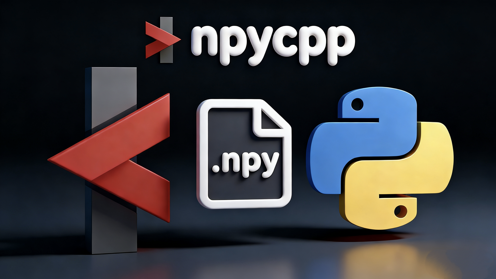

<p align="center">
  
  
</p>

<p align="center">
  
  
  
  
  
</p>

<p align="center">
  English |
  <a href="./README_CN.md">中文</a>
</p>

# npycpp - C++ Library for Reading and Writing NumPy File Formats

## Project Overview

`npycpp` is a high-performance `C++` library specifically designed for reading and writing NumPy's `.npy` and `.npz` file formats. The library provides seamless data exchange capabilities with the `Python NumPy` ecosystem, supporting multiple data types and arbitrary-dimensional array operations, while integrating mainstream numerical computing libraries such as `OpenCV` and `Eigen`.

## Core Features

### 🚀 High-Performance Data Exchange

- **Zero-Copy Operations**: Supports zero-copy data conversion with `OpenCV` and `Eigen` libraries
- **Lazy Loading**: On-demand loading during large file processing, significantly reducing memory usage
- **Efficient Serialization**: Optimized binary format read/write performance

### 📊 Format Compatibility

- **Complete Format Support**: Full support for `.npy` (single array) and `.npz` (compressed archive) formats
- **Type System**: Supports all NumPy basic data types (float, double, int, char, etc.)
- **Multi-Dimensional Arrays**: Supports storage and retrieval of tensor data with arbitrary dimensions

### 🔧 Framework Integration

- **`OpenCV` Integration**: Native support for `cv::Mat` data type conversion (supports zero-copy)
- **`Eigen` Integration**: Seamless integration with `Eigen::Matrix` matrix computation library (supports zero-copy)
- **Standard Library Compatibility**: Perfectly supports `STL` container types, using pointers to create `STL` containers (but will generate copies)

## Quick Start

### System Requirements

- **Compiler**: Compiler supporting `C++20` standard
- **Build Tool**: `CMake 3.10+`
- **Dependencies**: `OpenCV`, `Eigen3`, `Zlib`, `spdlog`

### Dependency Installation

```bash
sudo apt update
sudo apt install libopencv-dev 
sudo apt install libeigen3-dev 
sudo apt install zlib1g-dev 
sudo apt install libspdlog-dev
```

### Build and Install

```bash
# Clone and build project
git clone <repository-url>
mkdir build && cd build
cmake -DBUILD_TESTING=ON -DBUILD_EXAMPLES=ON -DCMAKE_BUILD_TYPE=Release ..
make -j$(nproc)

# Run test suite
ctest --verbose

# Install to system
sudo make install
```

### Project Integration

Integrate `npycpp` in your `CMake` project:

```cmake
find_package(npycpp REQUIRED)
target_link_libraries(<your_target> npycpp::npycpp)
```

### Basic Usage Examples

#### NpzReader/NpzWriter Exapmples

```c++
#include <cstdint>
#include <vector>

#include <npycpp/npycpp.hpp>

// Write data
std::vector<float> data_float = {1.0f, 2.0f, 3.0f, 4.0f};
std::vector<int> data_int = {1, 2, 3, 4};
std::vector<int64_t> shape_float = {2, 2};
std::vector<int64_t> shape_int = {2, 2, 1};

// Before using npz files, the writer must be closed to ensure file format integrity
// Method 1: Use RAII to ensure file is properly closed
{

  npy::NpzWriter writer("output.npz", npy::WriteMode::W);
  writer.AddNpyData("array_float", data_float.data(), shape_float);
}

// Method 2: Directly call Close() function
npy::NpzWriter writer("output.npz", npy::WriteMode::A);
writer.AddNpyData("array_int", data_int.data(), shape_int);
writer.Close();

// Read data and use
npy::NpzReader reader("output.npz");
npy::NpData npd = reader["array_float"];

// Access data
const float *ptr = npd.Ptr<float>();
```

#### NpyReader/NpyWriter Examples

```c++
#include <cstdint>
#include <vector>

#include <npycpp/npycpp.hpp>

// Writing NPY file using NpyWriter
std::vector<double> data = {1.0, 2.0, 3.0, 4.0, 5.0, 6.0};
std::vector<int64_t> shape = {2, 3};
npy::NpyWriter writer("matrix.npy");
writer.SaveNpyData(data.data(), shape);
writer.Close();

// Reading NPY file using NpyReader
npy::NpyReader reader("matrix.npy");
npy::NpData npd = reader.Load();

// Access data
const double *loaded_data = npd.Ptr<double>();
```

#### Data Container Examples

```c++
#include <cstdint>
#include <vector>

#include <npycpp/npycpp.hpp>
#include <fmt/format.h>

npy::NpData npd_data = npy::NpyReader("matrix.npy").Load();

// Print array shape
fmt::print("Array shape: [{}]\n", fmt::join(npd_data.Shape(), ", "));

// access data
const double *npd_data_ptr = npd_data.Ptr<double>();
for (int i = 0; i < npd_data.Elements(); ++i)
  fmt::print("{:>5.2f} ", npd_data_ptr[i]);

fmt::print("\n");

// OpenCV Integration
cv::Mat npd_cv = npd_data.CVMat<double>();        // Copy construction
cv::Mat npd_cv_view = npd_data.CVMatZC<double>(); // Zero-copy view

// Eigen Integration
auto npd_eigen = npd_data.EigenMatrix<double>();       // Copy construction
auto npd_eigen_map = npd_data.EigenMatrixZC<double>(); // Zero-copy mapping

// STL Integration (Copy construction)
std::vector<double> npd_stl(npd_data.Ptr<double>(), npd_data.Ptr<double>() + npd_data.Elements());

fmt::print("STL Wrapper: [{}]", fmt::join(npd_stl, ", "));
std::cout << "Eigen map Wrapper: \n" << npd_eigen_map << std::endl;
std::cout << "CV View Wrapper: \n" << npd_cv_view << std::endl;
```

## Testing and Validation

The project includes comprehensive unit tests:

- **[NpDataTest](test/NpDataTest.cc)**: Tests data container functionality
- **[NpzReaderTest](test/NpzReaderTest.cc)**: Tests npz file read functionality
- **[NpzWriterTest](test/NpzWriterTest.cc)**: Tests npz file write functionality
- **[NpyReaderTest](test/NpyReaderTest.cc)**: Tests npy file read functionality
- **[NpyWriterTest](test/NpyWriterTest.cc)**: Tests npy file write functionality

Run tests:

```bash
ctest --verbose
```

## Example Files

The project's [example folder](examples) contains a `Python` example scripts and a `C++` example source files for npy and npz file writing and reading, demonstrating data exchange between `C++` and `Python`.

```bash
./bin/npycpp_example # npy file example
./bin/npzcpp_example # npz file example
```

## License

This project follows the [MIT License](LICENSE) - see the [LICENSE](LICENSE) file for details.

## References

[1] [cnpy](https://github.com/rogersce/cnpy) - A C++ library for reading and writing NumPy's .npy and .npz files. Available: https://github.com/rogersce/cnpy

---

*This project is created and maintained by ssl, dedicated to providing efficient and easy-to-use C++/Python data exchange solutions.*